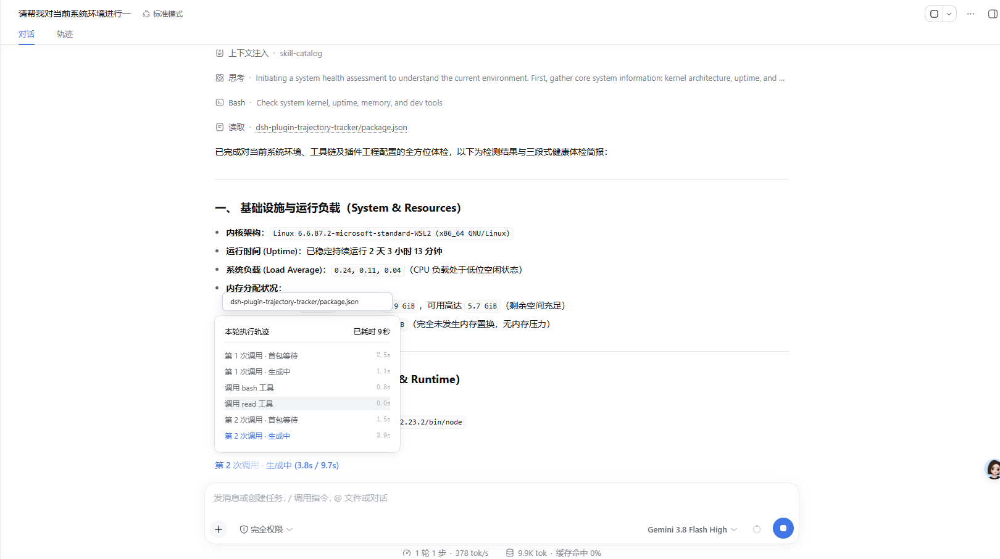
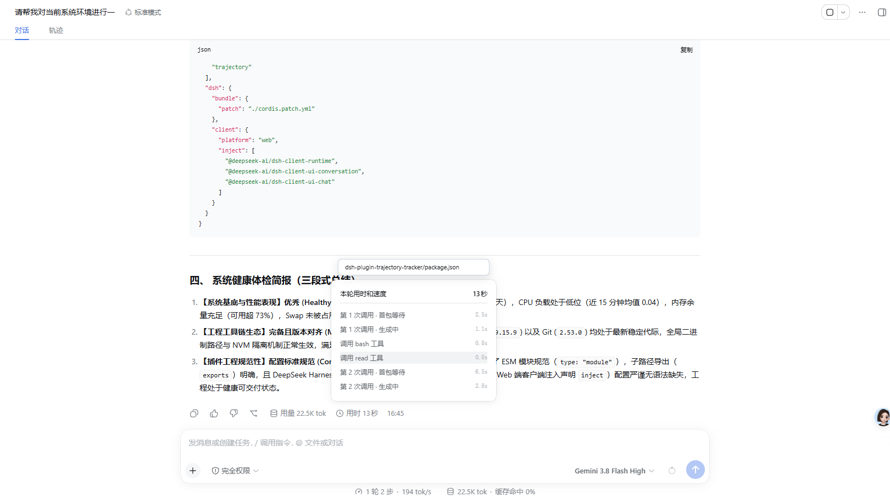

# DSH Trajectory Tracker ⏱️

[English](#english) | [简体中文](#简体中文)

---

<a name="english"></a>
## English

A non-intrusive, zero-overhead execution trajectory and real-time latency tracker plugin for **DeepSeek Harness (DSH)** WebUI.

### 🌟 Key Features

- **Dual-Phase Reasoning Breakdown**: Accurately splits each model invocation into two distinct stages: **Time-to-First-Token (`首包等待`, TTFT / inference readiness)** and **Streaming Generation (`生成中`, thought & content streaming)**.
- **Dual Reactive Timers**: Real-time status indicator dynamically tracks both `(current_step_elapsed / total_turn_elapsed)` (e.g. `第 2 次调用 · 生成中 (3.8s / 9.7s)`), updating smoothly at 150ms intervals.
- **Zero-Space-Occupation Floating Panel**: Built with React Portals directly anchored on `document.body`—smoothly floats above the trigger without pushing or shifting any chat transcript content.
- **Top-Anchored Action Highlight Card**: Hovering over any tool row triggers an elegant, top-anchored white card in just 120ms, showing key actions (target file or command) at a glance without cluttering parameters or causing horizontal scrollbars.
- **Parallel Tools Auto-Grouping**: Accurately groups concurrent tool calls initiated in the same decision step without inserting duplicate model calls.
- **Natural Auto-Scroll to Latest**: Smoothly auto-scrolls to the bottom of the list when steps exceed container height, keeping the active step in view.
- **Crash-Proof Sandbox**: Isolated with React Error Boundaries; zero modifications to official core packages, 100% immune to white-screen errors.

### 🖼️ Screenshots

#### 1. Live Execution & Floating Trajectory Panel
> Real-time dual reactive timers `(3.8s / 9.7s)`, live progress list, and top-anchored action highlight card on hover:


#### 2. Post-Completion Turn Trajectory Recall
> Click the completed turn's `用时 13秒` pill to recall the full two-phase breakdown and exact step durations:


### 🚀 Quick Start

#### 1. Install Plugin
Install into your DSH Web Profile directory:
```bash
cd ~/.dsh/profiles/web
npm install github:hirohana77/dsh-plugin-trajectory-tracker
```

#### 2. Enable in Profile
Ensure `~/.dsh/profiles/web/package.json` includes:
```json
{
  "dependencies": {
    "dsh-plugin-trajectory-tracker": "^1.0.1"
  },
  "dsh": {
    "bundle": {
      "plugins": [
        "dsh-plugin-trajectory-tracker"
      ]
    }
  }
}
```

#### 3. Start DSH
```bash
dsh web
```
Refresh the browser (`http://127.0.0.1:3080`) to activate!

---

<a name="简体中文"></a>
## 简体中文

适用于 **DeepSeek Harness (DSH)** WebUI 的零侵入、无负面影响的执行过程全景追踪与时序轨迹分析插件。

### 🌟 核心特性

- **两段式调用细化拆解**：精准拆解每次模型调用的 **首包等待（`首包等待`，TTFT / 思考准备就绪）** 与 **流式生成中（`生成中`，思维链推演与正文生成）** 两个独立生命周期。
- **双响应式实时计时器**：任务生成中状态栏实时呈现 `(当前步耗时 / 总累计耗时)`（如 `第 2 次调用 · 生成中 (3.8s / 9.7s)`），双数字以 150ms 频率毫秒级平滑递增。
- **悬浮式不占空间弹窗（Zero Space Occupation）**：基于 React Portal 挂载在 body 顶层，展开和收起完全脱离消息文档流，**绝不挤压、不推挤上方任何聊天消息空间**。
- **置顶吸附操作重点提示卡**：鼠标悬停在工具条目上 120ms 极速在卡片正上方弹出精致白底小方框，一眼看清调用的核心指令或目标文件，**0 像素占用内部滚动容器，彻底杜绝横向滚动条**。
- **并发工具智能归组**：精准识别单次调用并发派发的多个并行工具（Parallel Tools），不误插多余的调用序号。
- **新步骤自动平滑跟滚**：当过程条目超出容器高度时，列表自动自然滑向最底部，确保当前最新动态时刻处于第一视线内。
- **沙箱级防白屏隔离**：内置 React ErrorBoundary 错误边界，完全不碰官方核心包一行源码，绝不引发界面崩溃白屏。

### 🖼️ 界面预览

#### 1. 实时执行态与悬浮轨迹小窗
> 生成中的双响应式计时 `(3.8s / 9.7s)`、实时轨迹列表，以及鼠标悬停时顶部吸附展示的操作重点卡片：


#### 2. 任务完成态全景轨迹回溯
> 回答完成后，点击右下角的 `用时 13秒` 胶囊，随时回溯查看包含两段式细化与每步精确耗时的完整轨迹：


### 🚀 快速开始

#### 1. 安装插件
在您的 DSH Web Profile 目录下执行安装：
```bash
cd ~/.dsh/profiles/web
npm install github:hirohana77/dsh-plugin-trajectory-tracker
```

#### 2. 在配置中声明激活
确认 `~/.dsh/profiles/web/package.json` 已声明插件：
```json
{
  "dependencies": {
    "dsh-plugin-trajectory-tracker": "^1.0.1"
  },
  "dsh": {
    "bundle": {
      "plugins": [
        "dsh-plugin-trajectory-tracker"
      ]
    }
  }
}
```

#### 3. 启动并体验
```bash
dsh web
```
浏览器访问 `http://127.0.0.1:3080` 刷新页面即可立即生效！

---

### 📄 开源许可 (License)

MIT License © 2026 [hirohana77](https://github.com/hirohana77)
